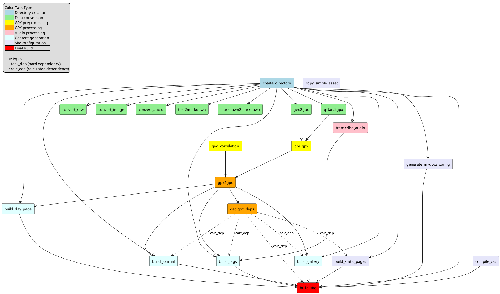

# Task Dependencies

This document shows the dependency graph of the various build tasks in mkmapdiary. The tasks are organized in a directed acyclic graph (DAG) where arrows indicate dependencies.

## Task Description

### Directory Creation Tasks
- **create_directory**: Creates all necessary directories for the build process

### Data Conversion Tasks
- **geo2gpx**: Converts GeoJSON/GeoYAML files to GPX format
- **qstarz2gpx**: Converts Qstarz GPS device files to GPX format
- **convert_raw**: Converts CR2 raw image files to JPEG
- **convert_image**: Processes and converts image files
- **convert_audio**: Converts audio files to MP3 format
- **text2markdown**: Converts plain text files to Markdown
- **markdown2markdown**: Processes existing Markdown files

### GPX Processing Tasks
- **pre_gpx**: Preparation step for GPX processing, ensures dependencies are met
- **geo_correlation**: Correlates geographic data with timestamps
- **gpx2gpx**: Main GPX processing task that generates daily GPX files
- **get_gpx_deps**: Calculates dependencies on GPX files for downstream tasks

### Content Generation Tasks
- **transcribe_audio**: Transcribes audio files to text using AI
- **build_day_page**: Generates daily summary pages
- **build_gallery**: Creates photo gallery pages for each day
- **build_journal**: Builds journal entries from various content sources
- **build_tags**: Generates tag-based content organization

### Site Building Tasks
- **generate_mkdocs_config**: Creates the MkDocs configuration file
- **build_static_pages**: Generates static pages like the index
- **compile_css**: Compiles SASS to CSS
- **copy_simple_asset**: Copies static assets (JS, CSS, images)
- **build_site**: Final step that builds the complete MkDocs site

## Dependency Types

The flowchart shows two types of dependencies:
- **Solid arrows** (`task_dep`): Hard dependencies that must complete before the task can start
- **Dotted arrows** (`calc_dep`): Calculated dependencies that are computed at runtime

The `@create_after` decorator is used for tasks that need to be created after other tasks complete, which is represented by the dependencies from `gpx2gpx` to various content generation tasks.